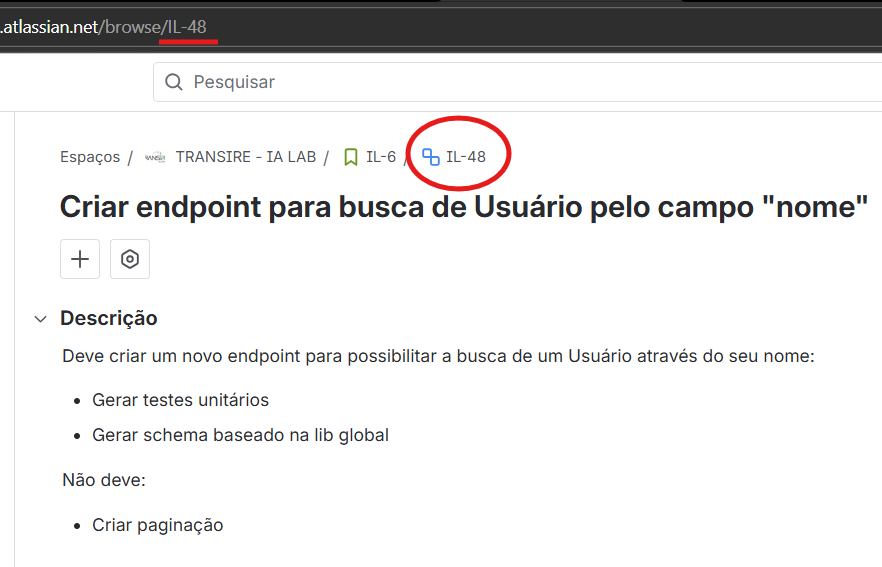
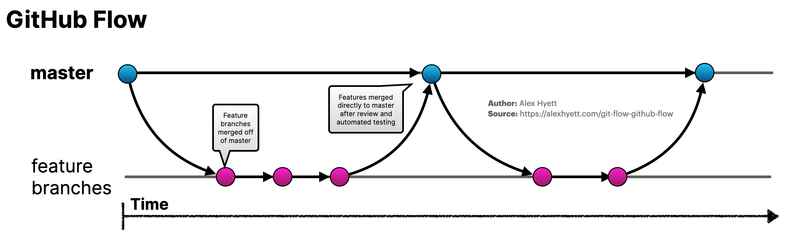

# Git Flow e boas práticas de desenvolvimento

Este documento descreve o fluxo de trabalho adotado no time (branches, commits e Pull Requests) e um conjunto de boas práticas para manter consistência, qualidade e rastreabilidade.

## Sumário

- [Mensagem de commit](#mensagem-de-commit)
- [Nome da branch](#nome-da-branch)
- [GitHub Flow](#github-flow)
- [Rotinas do Pull Request](#rotinas-do-pull-request)
- [Boas práticas](#boas-práticas)

## Mensagem de commit

Os commits seguem o [Conventional Commits](https://www.conventionalcommits.org/pt-br/v1.0.0/). Para melhor rastreabilidade e leitura do histórico, padronizamos o **Jira ID como escopo**:

```text
<tipo>(<jira-id>): <descrição>

[corpo opcional]

[rodapé(s) opcional(is)]
```

Exemplo:



```text
feat(IL-48): create endpoint to find user by name
```

É recomendado (e encorajado) usar o agente de IA para criar a mensagem de commit. Exemplo de prompt:

```text
Crie a mensagem de commit e adicione no corpo o resumo de todas as modificações feitas. Utilize a skill git-commit.
```

> Nota: revise a mensagem gerada e garanta que o escopo contenha o `<jira-id>`.

Regras e recomendações:

- Use a descrição curta e objetiva (idealmente até ~72 caracteres).
- Prefira verbo no imperativo (“add”, “fix”, “remove”, “update”).
- Tipos mais comuns: `feat`, `fix`, `refactor`, `test`, `docs`, `chore`.
- Se houver quebra de compatibilidade, use `!` no tipo (ex.: `feat!(IL-48): ...`) e detalhe no corpo/rodapé.

## Nome da branch

O nome da branch segue o tipo e o Jira ID (e opcionalmente uma breve descrição):

```text
<tipo>/<jira-id>[-descricao-curta]
```

Exemplos:

```text
feat/IL-48
feat/IL-48-find-user-by-name
```

## GitHub Flow



> Trabalhe em branches curtas e integre via PR.

1. `master` sempre deployável
2. Criar uma branch de feature/fix/refactor a partir da `master` atualizada
3. Fazer commits pequenos e frequentes
4. Abrir Pull Request
5. Code review
6. Merge na `master`
7. Apague a branch da task
8. Deploy

## Rotinas do Pull Request

Recomendações gerais:

- Prefira PRs pequenos (um assunto por PR) e com boa descrição.
- Evite commits “WIP” e mensagens genéricas.
- Se o repositório usar squash merge, agrupe commits quando fizer sentido.

### Ao surgir necessidade de modificações no PR

1. Faça as modificações
2. Crie um novo commit seguindo o padrão em [Mensagem de commit](#mensagem-de-commit)

### Atualização da branch de task

Mantenha sua branch atualizada com a `master` via rebase (evite merge commits):

```shell
git fetch origin
git rebase origin/master
```

Se você reescreveu o histórico (rebase), suba com segurança usando:

```shell
git push --force-with-lease origin <branch>
```

## Boas práticas

### Qualidade e escopo

- Seja sucinto e objetivo: implemente apenas o que o card pede (e o que é necessário para manter o sistema consistente).
- Prefira mudanças pequenas e incrementais; evite “mega PRs”.
- Mantenha a solução simples; abstraia somente quando houver necessidade real.

### Testes

- Priorize TDD quando a mudança tiver lógica de negócio relevante (red-green-refactor).
- Adicione/atualize testes junto com a feature/correção (evite “testes depois”).
- Não faça merge com testes quebrados (ou sem justificar o porquê).

### Nomenclatura de domínio e entidades

Em sistemas cujo domínio está fortemente ligado ao contexto brasileiro (ex.: financeiro, fiscal ou contábil), é aceitável utilizar português nos conceitos de domínio, seguindo o princípio de Ubiquitous Language do DDD — ou seja, o código deve refletir a linguagem utilizada pelo negócio.

Regras adotadas:

- Conceitos de domínio de negócio podem ser nomeados em português.

```typescript
class Vertical {}
class Executivo {}
class ReceitaPonderada {}
class PCP {}
```

- Não utilizar acentuação em nomes de código, banco de dados e variáveis.
- Pode misturar português e inglês para termos técnicos/infraestrutura.

```typescript
class PrismaVariacaoRepository implements IVariacaoRepository {}
class CreateReceitaPonderadaUseCase implements IUseCase {}
```
